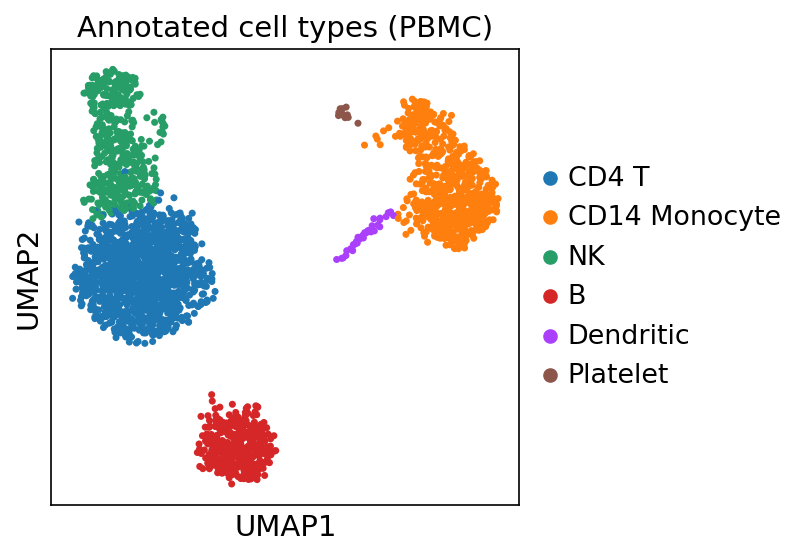
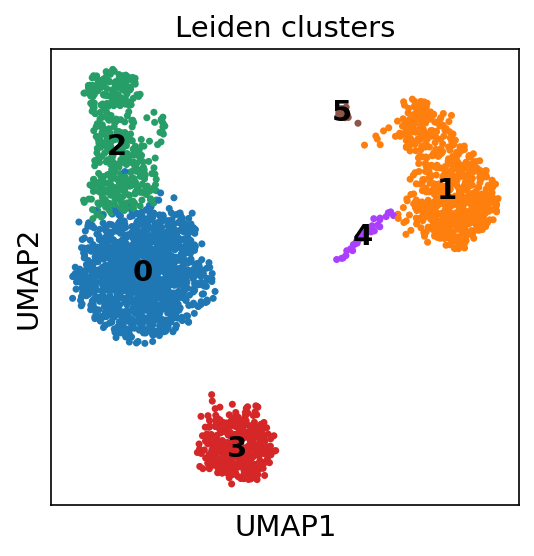

# Single-Cell RNA-seq Analysis of 3k PBMCs

A complete, reproducible single-cell RNA-seq workflow run on the **real, public
10x Genomics PBMC3k dataset** (~2,700 peripheral blood mononuclear cells from a
healthy donor). It takes raw counts all the way to annotated cell types, and the
figures below are generated automatically by the analysis — not mock-ups.

> Every figure and table in this repo is produced by `scrna_pbmc_analysis.py`
> running in GitHub Actions. Delete `figures/` and `results/`, re-run, and they
> come back identical. That is what reproducible means.

## The Result



The UMAP above shows the major immune populations you expect to find in blood —
T cells (CD4 and CD8), B cells, NK cells, monocytes, and dendritic cells —
recovered from raw counts with no manual gating.




The dot plot confirms the labels: each cell type expresses its canonical markers
(e.g. `MS4A1` for B cells, `CD14`/`LYZ` for monocytes, `GNLY`/`NKG7` for NK cells).

## What the Pipeline Does

1. **Quality control** — remove low-quality cells (too few genes) and likely
   dead cells (high mitochondrial content), and drop genes seen in too few cells.
2. **Normalisation** — total-count normalise to 10,000 reads per cell, then
   log-transform, so deep- and shallow-sequenced cells are comparable.
3. **Feature selection** — keep the highly variable genes that carry the
   biological signal and discard housekeeping noise.
4. **Dimensionality reduction** — PCA, then a neighbourhood graph, then UMAP.
5. **Clustering** — Leiden community detection groups transcriptionally similar
   cells.
6. **Annotation** — each cluster is labelled with a cell type by scoring it
   against canonical PBMC marker genes.

## Run It Yourself

```bash
pip install -r requirements.txt
python scrna_pbmc_analysis.py
```

Outputs:

- `figures/umap_celltypes.png` — UMAP coloured by annotated cell type
- `figures/umap_clusters.png` — UMAP coloured by Leiden cluster
- `figures/violin_qc.png` — QC distributions (genes, counts, % mitochondrial)
- `figures/dotplot_markers.png` — marker-gene expression per cell type
- `results/cluster_markers.csv` — ranked differentially expressed genes per cluster
- `results/cell_type_counts.csv` — number of cells per type
- `results/summary.txt` — a plain-text run summary

## How to Read a UMAP (and How Not To)

Each dot is a cell; nearby dots are transcriptionally similar. UMAP preserves
**local** structure, so distinct clusters mean distinct cell types — but the
**distance between** clusters is not meaningful, and cluster size does not imply
biological importance. Always confirm identities with marker genes, which is
exactly what the dot plot here does.

## Data & Methods

- **Data:** 10x Genomics PBMC3k, fetched via `scanpy.datasets.pbmc3k()`.
- **Tools:** Scanpy, AnnData, scikit-learn, Leiden, UMAP, matplotlib.
- **Reproducibility:** pinned dependencies in `requirements.txt`; the full
  pipeline is one script with no manual steps.
